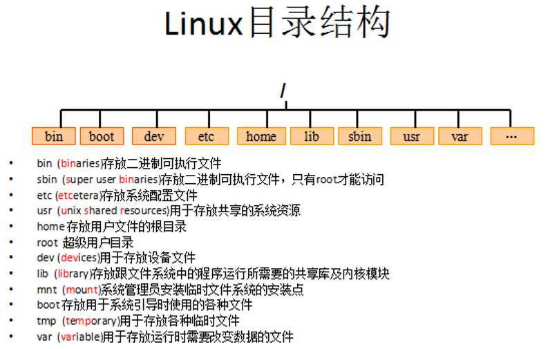

# 简介

##应用

服务器系统：Web应用服务器、数据库服务器、接口服务器、DNS、FTP等等； 

嵌入式系统：路由器、防火墙、手机、PDA、IP 分享器、交换器、家电用品的微电脑控制器等等，

高性能运算、计算密集型应用Linux有强大的运算能力。

桌面应用系统

移动手持系统

## 版本

Linux的版本分为两种：内核版本和发行版本

内核版本是指在Linus领导下的内核小组开发维护的系统内核的版本号 ；

# 远程访问

ip地址 默认端口22

用户名+密码

# 目录结构

[root@itcast ~]# pwd
/root



root管理员的home目录：root

其他用户的home目录：home目录中

# 常用命令

##文件列表

```
* ls
* ls -a  显示所有文件或目录（包含隐藏的文件）
* ls -l  缩写成ll
```

## 切换目录

```
cd app	
cd usr/etc

cd ..	切换到上一层目录
cd /	切换到系统根目录
cd ~	切换到用户主目录
cd -	切换到上一个所在目录

*使用tab键来补全文件路径

```

##创建删除目录

```
mkdir(make directory)命令可用来创建子目录。
    mkdir test
    mkdir -p test/test2
    
rmdir(remove directory)命令可用来删除“空”的子目录：
	rmdir test
```

## 文件查看

```
cat用于显示文件的内容。格式：cat[参数]<文件名>
* cat yum.conf

more一般用于要显示的内容会超过一个画面长度的情况
* more yum.conf
* 空格显示下一页数据，回车显示下一行的数据，按q键退出查看。
     
* less yum.conf
* 空格显示下一页数据，回车显示下一行的数据，按q键退出查看。
* 新增PgUp 和 PgDn 进行上下翻页.
```

```
tail命令是在实际使用过程中使用非常多的一个命令，功能是：用于显示文件后几行的内容。
用法:
tail -10 /etc/passwd  查看后10行数据
tail -f catalina.log  动态查看日志(*****)
ctrl+c 结束查看

```

## 文件删除拷贝

```
cp(copy)命令可以将文件从一处复制到另一处。
一般在使用cp命令时将一个文件复制成另一个文件或复制到某目录时，需要指定源文件名与目标文件名或目录。

cp hello.txt hi.txt 将a.txt复制为b.txt文件
cp hello.txt ../   将a.txt文件复制到上一层目录中

mv 移动或者重命名
mv hello.txt helloworld.txt
mv hi.txt ../

```

```
rm  删除文件
rm a.txt  删除需要用户确认，y/nrm 删除不询问

rm -f a.txt 不询问，直接删除rm 删除目录
rm -r a     递归删除不询问递归删除（慎用）

rm -rf a   不询问递归删除
rm -rf *   删除所有文件
rm -rf /*  自杀

```

##文件打包或解压

```
tar命令位于/bin目录下，它能够将用户所指定的文件或目录打包成一个文件，但不做压缩。
一般Linux上常用的压缩方式是选用tar将许多文件打包成一个文件，再以gzip压缩命令压缩成xxx.tar.gz(或称为xxx.tgz)的文件。

tar -cvf t.tar test      打包test
tar -zcvf t.tar.gz test	 打包并压缩test

tar -zxvf t.tar.gz 解压
tar -zxvf t.tar.gz -C /usr/abc 解压到指定目录

```

##文件查找

```
find指令用于查找符合条件的文件
示例：
find / -name “ins*” 查找文件名称是以ins开头的文件
find / -name “ins*” –ls 
find / –user itcast –ls 查找用户itcast的文件
find / –user itcast –type d –ls 查找用户itcast的目录
find /-perm -777 –type d-ls 查找权限是777的文件

```

```
查找文件里符合条件的字符串。
用法: grep [选项]... PATTERN [FILE]...示例：
grep lang anaconda-ks.cfg  在文件中查找lang
grep lang anaconda-ks.cfg --color 高亮显示

```

## 其他

```
【pwd】
显示当前所在目录
【touch】
创建一个空文件
* touch a.txt
【clear/ crtl + L】
清屏

```

## vim

```
三种模式：命令行、插入、底行模式。
切换到命令行模式：按Esc键；
切换到插入模式：按i、o、a键；
    i 在当前位置前插入
    I 在当前行首插入
    a 在当前位置后插入
    A 在当前行尾插入
    o 在当前行之后插入一行
    O 在当前行之前插入一行
切换到底行模式：按 :（冒号）；

打开文件：vim file
退出：esc → :q
修改文件：输入i进入插入模式
保存并退出：esc → :wq
不保存退出：esc → :q!

快捷键：
dd – 快速删除一行
yy - 复制当前行
nyy - 从当前行向后复制几行
p - 粘贴
R – 替换

```

## 重定向输出

```
>  重定向输出，覆盖原有内容；
>> 重定向输出，又追加功能；

ifconfig > ifconfig.txt
cat hello.txt >> hi.txt  输出并且追加

```

## 系统管理命令

```
ps –ef  查看所有进程
ps –ef | grep ssh 查找某一进程

kill 2868  杀掉2868编号的进程
kill -9 2868  强制杀死进程
```

## 管道

```
管道是Linux命令中重要的一个概念，其作用是将一个命令的输出用作另一个命令的输入
ls --help | more  分页查询帮助信息
ps –ef | grep java  查询名称中包含java的进程

```

# 文件类型与权限


```
普通文件： 包括文本文件、数据文件、可执行的二进制程序文件等。 
目录文件： Linux系统把目录看成是一种特殊的文件，利用它构成文件系统的树型结构。  
设备文件： Linux系统把每一个设备都看成是一个文件

普通文件（-）
目录（d）
符号链接（l）
* 进入etc可以查看，相当于快捷方式
字符设备文件（c）块设备文件（s）套接字（s）命名管道（p）

```

```
chmod 变更文件或目录的权限。
chmod 755 hello.txt  等价于
chmod u=rwx,g=rx,o=rx hello.txt
```

# 网络操作

##查看主机名

```
hostname 查看主机名
hostname xxx 修改主机名 重启后无效
如果想要永久生效，可以修改/etc/sysconfig/network文件
```

##修改IP地址

```
ifconfig 查看(修改)ip地址(重启后无效)
ifconfig eth0 192.168.12.22 修改ip地址
如果想要永久生效，修改 /etc/sysconfig/network-scripts/ifcfg-eth0文件

DEVICE=eth0 #网卡名称
BOOTPROTO=static #获取ip的方式(static/dhcp/bootp/none)
HWADDR=00:0C:29:B5:B2:69 #MAC地址
IPADDR=12.168.177.129 #IP地址
NETMASK=255.255.255.0 #子网掩码
NETWORK=192.168.177.0 #网络地址
BROADCAST=192.168.0.255 #广播地址
NBOOT=yes #  系统启动时是否设置此网络接口，设置为yes时，系统启动时激活此设备。

```

##域名映射

```
/etc/hosts文件用于在通过主机名进行访问时做ip地址解析之用,
相当于windows系统的C:\Windows\System32\drivers\etc\hosts文件的功能
添加一行
192.168.133.131 it
ping it
```

##网络管理服务

```
service network status 查看指定服务的状态
service network stop 停止指定服务
service network start 启动指定服务
service network restart 重启指定服务

service --status-all 查看系统中所有后台服务
netstat -nltp 查看系统中网络进程的端口监听情况

防火墙设置
防火墙根据配置文件/etc/sysconfig/iptables来控制本机的”出”、”入”网络访问行为。
service iptables status 查看防火墙状态
service iptables stop 关闭防火墙
service iptables start 启动防火墙
chkconfig iptables off 禁止防火墙自启

```

